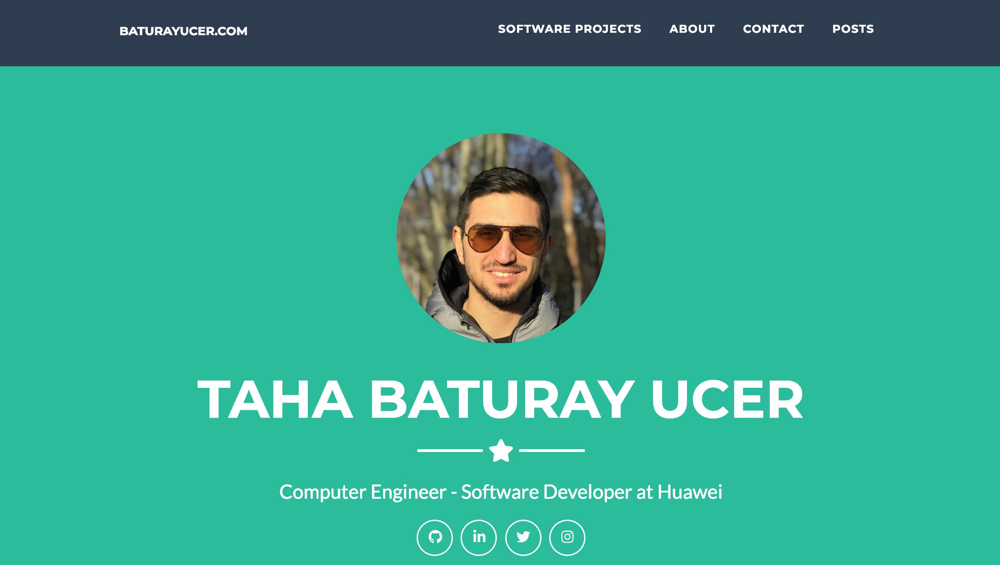
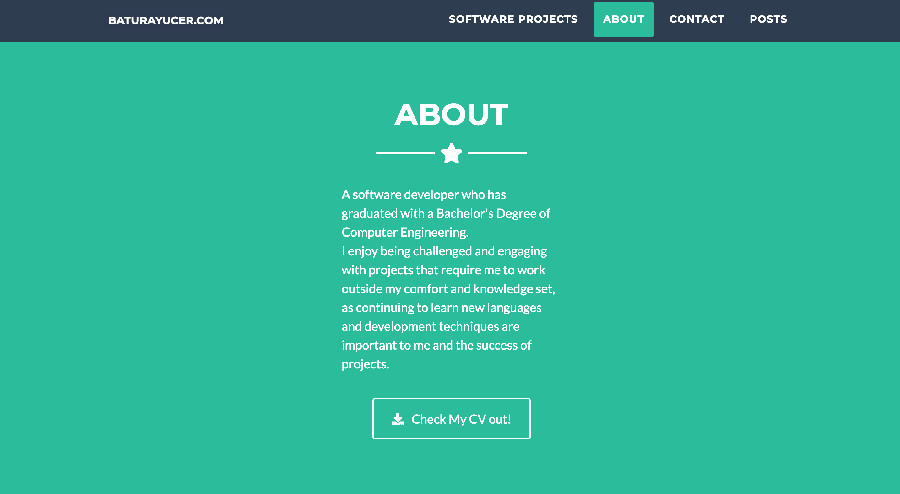
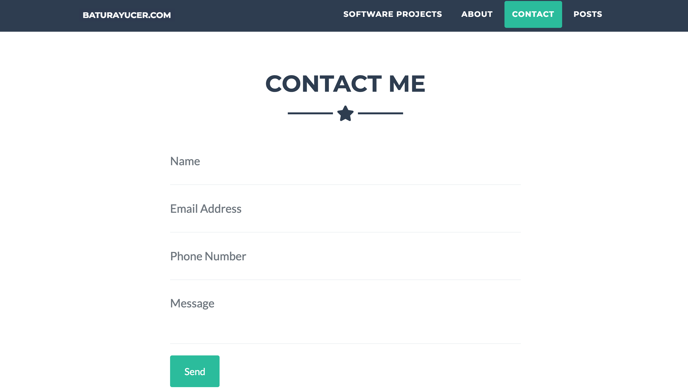
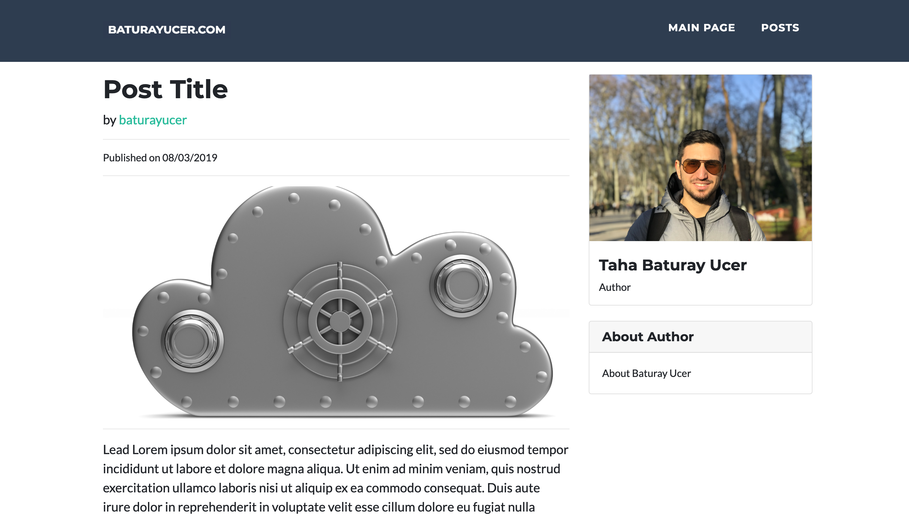
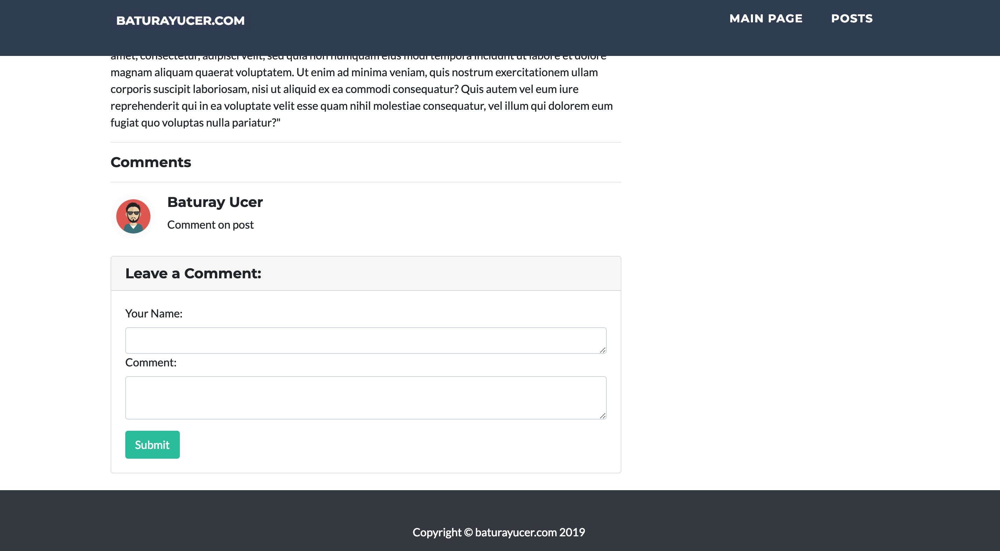

**Django Personal Blog Web App**

**#Keywords: python, django, bootstrap, javascript, jquery **

This project is a way for people to have their own web page that customizes their portfolio and helps them to share their posts in a nicely-formatted manner. 
The application contains two section:

#1) Portfolio Part:
- This part have been design by single-page design and it helps you to describe yourself and tell about your activities. 

  
- You can share your CV by using "about me" section 

  
- People can send email to you by using "contact me" section.  

  

#2) Blog Part:
- You can now publish your posts and articles with simple, elegant design. 

  
- Only authors can publish a post(django authentication). 
- Users can comment on posts easily. 

  
- Sqlite database is used to store posts, authors and comments.
 
#To run  
`python manage.py makemigrations`  
`python manage.py migrate`  
'python manage.py loaddata admin.json'  
`pyton manage.py runserver`  

